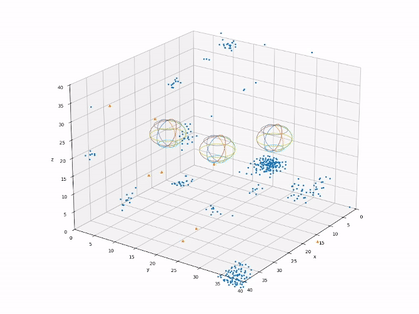
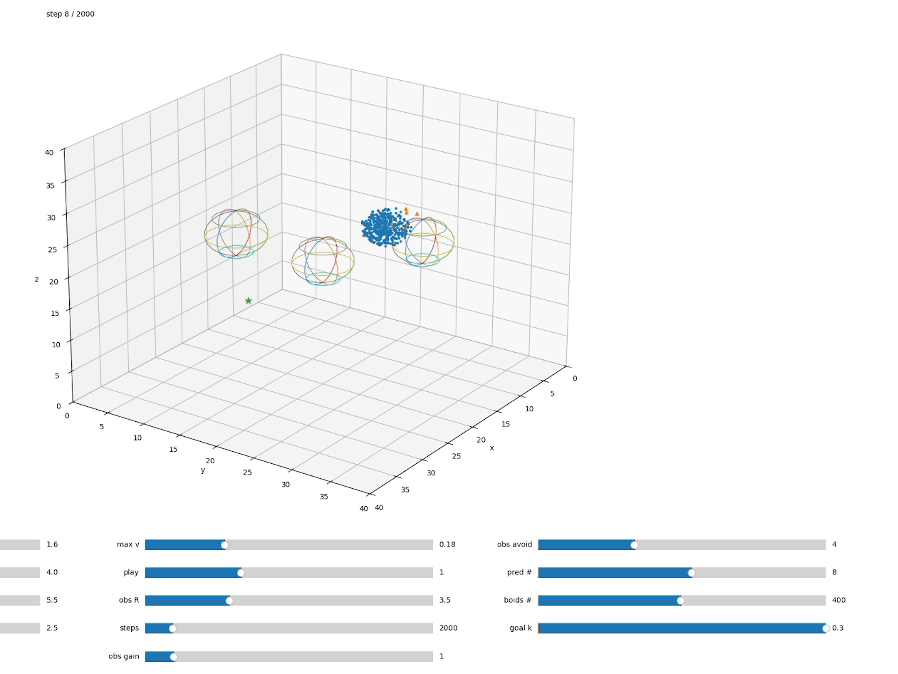
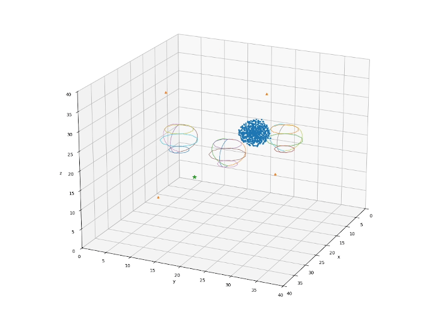

### Fish School / Boids-Inspired Multi-Agent Simulation and Learning for GMR Modelisation

This repository implements a **multi-agent collective motion framework** inspired by **fish schools and boid models**, and extended with **probabilistic reinforcement learning** and **latent policy parameters** (θ) for drones simulation.

The codebase supports:
- Emergent collective motion without explicit goals (free roaming)
- Goal-directed collective navigation
- Replayable environments to animate or re-execute a learned parameter vector θ
- Reinforcement learning over low-dimensional behavior parameters
- Live Prediction using GMM-GMR

---

## 🐠 Biological & Algorithmic Inspiration

This work is inspired by classical and modern studies of collective schooling, in particular:

- **Boids model** (Reynolds, 1987)
- Erik Martin Vetemaa Bachelor Thesis, https://github.com/vetemaa/fish-simulation and https://thesis.cs.ut.ee/a62fdbba-061c-475d-851e-8c49d61b09df

---

## 📂 Project Structure

env/
- env.py — Core multi-agent environment
- env.py can be run as main file to visualize a given action vector parameter.

scripts/
- free_roam.py — Emergent motion without a goal
- train_rl.py — Reinforcement learning over θ to learn the "best" behaviour given a reward
- gmr_example.py - A GMR is fitted and update based on the previous path (SpaceMouse control)
- gmr_with_LMPC_controller.py - The user is additionnally constraint by an LMPC to avoid the obstacles, and a shared controller guides him using the GMR

---

## 🎥 Demos

### 🔹Free-roam: Fishes don't have any goal besides avoid obstacles and predators

### 🔹 Goal-oriented roamn: Fishes try to reach given goals defined by a weighted graph

### 🔹 Goal-oriented roam after RL-optimization

### 🔹 GMR Fitting with Multiple Goals

### 🔹 Shared Controller

---

## 🧪 Main Scripts

### Free Roam — Emergent Collective Motion

Purely emergent behavior with no explicit goal, driven only by local interactions, similar to Erik Martin Vetemaa implementation, with modified behaviour.

### Environment & Replay
RL/env.py

Deterministic replay and visualization of learned θ, with goals as a graph with weighting probablities.

### Reinforcement Learning
train_rl.py

Policy search over θ using probabilistic reinforcement learning using Power RL.

### GMR Fitting
gmr_example.py

Fit a GMR regression on fishes trajectories.

### Shared Controller
gmr_with_LMPC_controller.py

A shared controller ensure safe motion and pull towards GMR model.

---

## 📜 License

MIT License — see LICENSE file.

---

## ⭐ Acknowledgments

- Craig Reynolds — Boids (1987)